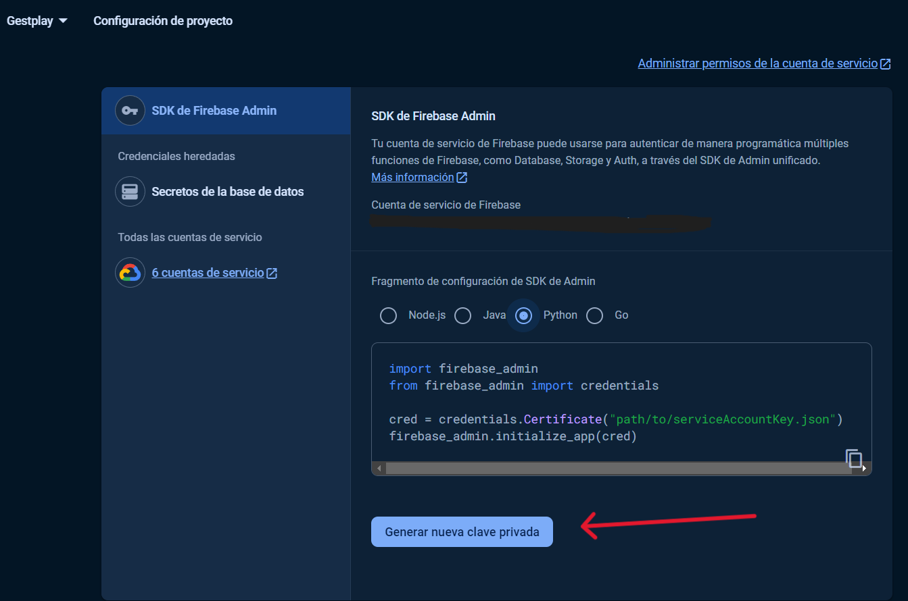

# Gestplay
 API for gestplay

## Table of Contents

- [Requirements](#requirements)
- [Installation](#installation)
- [Usage](#usage)
- [API Documentation](#api-documentation)
- [License](#license)

## Requirements

In order to use this service, you will need the following:

- PostgreSQL database: The API requires a PostgreSQL database to store user information and authentication data.

- MongoDB database: The API also requires a MongoDB database to store game data and perform certain operations.

- Gmail account: You will need a Gmail account and an App password to send emails for password reset and other notifications.
  Recomended tutorial: [Tutorial](https://www.youtube.com/watch?v=g_j6ILT-X0k)

- Firebase storage service keys: You will need a JSON file containing the service keys for Firebase storage. This is necessary for storing user profile pictures. the file should be placed in the route: src\api\db\keys\serviceAccountKey.json.




Please make sure you have these requirements set up before proceeding with the installation.


## Installation
1. Clone the repository:

    ```bash
    git clone https://github.com/EmilioMontalvo/gestplay_auth.git
    ```

2. Create a virtual environment:

    ```bash
    virtualenv -p python3.12.3  env
    ```

3. Activate the virtual environment:

    ```bash
    .\env\Scripts\activate
    ```

4. Create a `.env` file based on the `.env.template` file.

5. Install the dependencies:

    ```bash
    pip install -r requirements.txt
    ```

## Usage

1. Start the FastAPI server:

    ```bash
    python .\src\main.py
    ```

2. Open your browser and navigate to `http://localhost:8000` to access the API.

## API Documentation

The API documentation can be found at `http://localhost:8000/docs`.

## License

This project is licensed under the [APACHE LICENSE 2.0](LICENSE).
